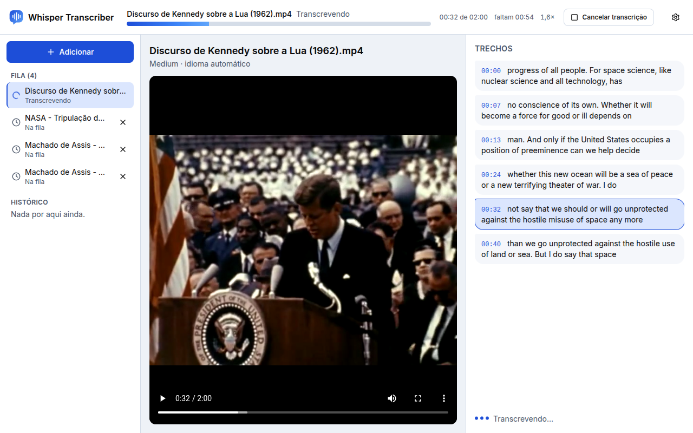
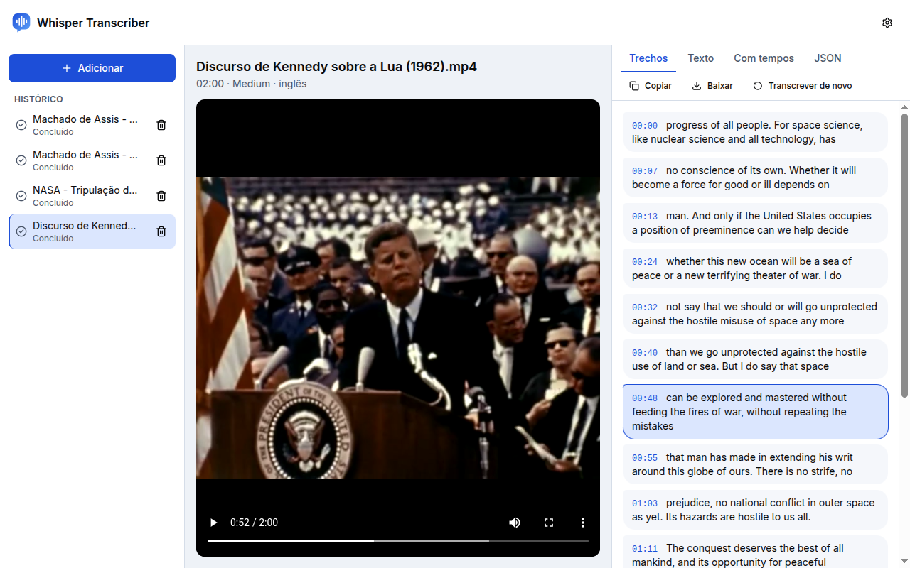
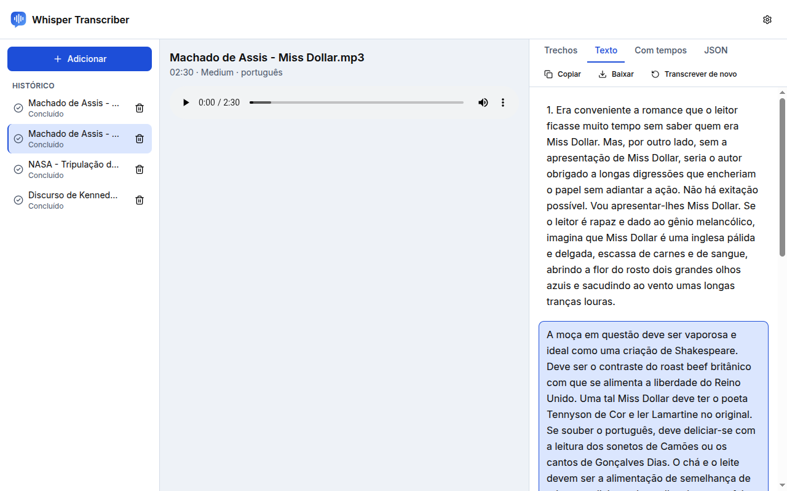
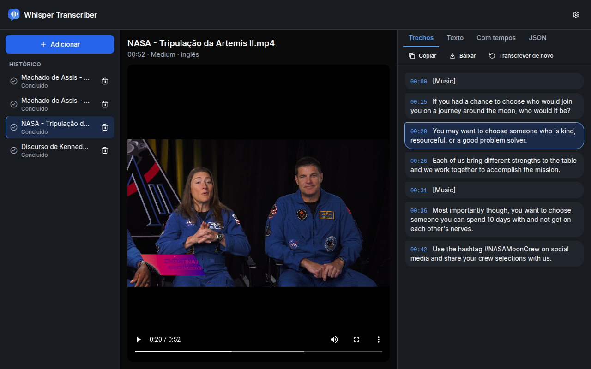
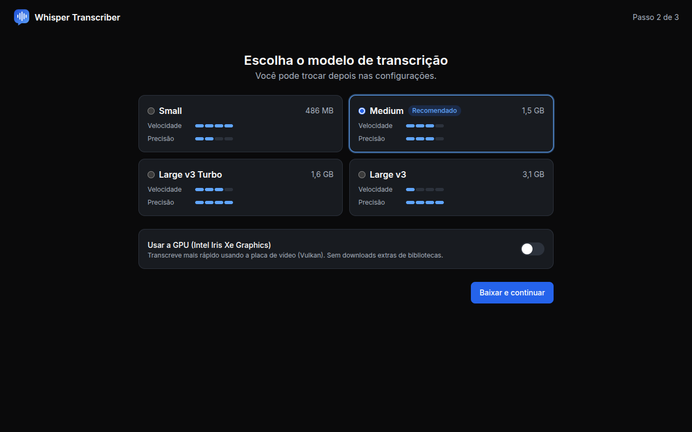
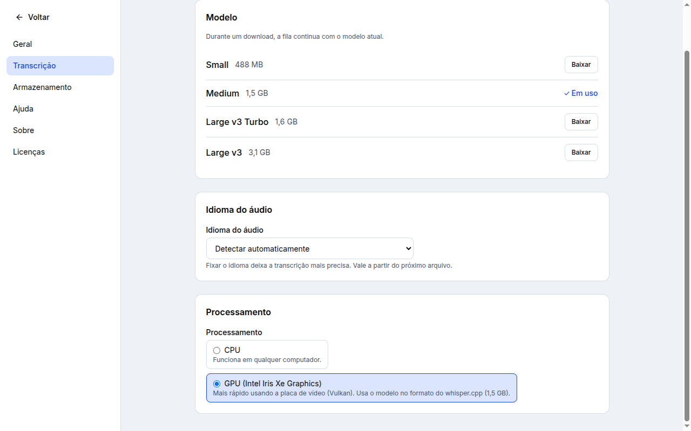
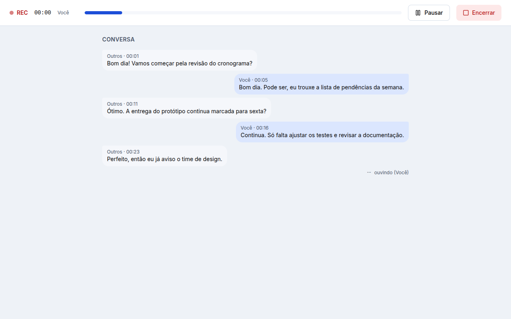
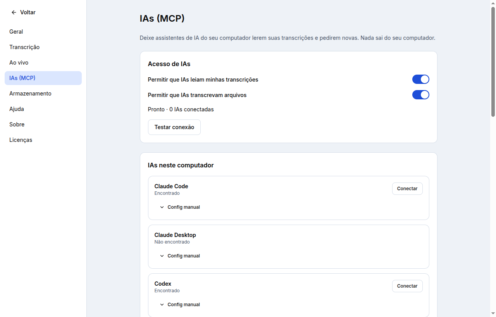

# Whisper Transcriber

App desktop (Windows, macOS e Linux) para transcrever vídeos e áudios **no seu computador**,
sem enviar nada para a internet, usando os modelos Whisper via [faster-whisper](https://github.com/SYSTRAN/faster-whisper)
e [whisper.cpp](https://github.com/ggml-org/whisper.cpp) (GPU por Vulkan ou Metal).

- Arraste vídeos ou áudios para a janela; a fila transcreve um por vez.
- Os trechos aparecem ao vivo, como num chat, sincronizados com o player.
- Resultado em **Texto** (parágrafos), **Com tempos** e **JSON**, com Copiar e Baixar.
- **Ao vivo** para reuniões e chamadas: transcreve o microfone ("Você") e o áudio do computador
  ("Outros") frase a frase, grava tudo e deixa refazer com o áudio completo depois.
- Histórico com o áudio salvo; GPU NVIDIA (CUDA), AMD/Intel (Vulkan) ou Apple Silicon (Metal).
- **IAs (MCP):** Claude Code, Codex, OpenCode e outras leem, buscam e transcrevem por você, sem
  nada sair do computador.
- Interface em português, inglês e espanhol; temas claro, escuro ou do sistema.

## Veja funcionando



|                                                                                               |                                                                                                           |
| --------------------------------------------------------------------------------------------- | --------------------------------------------------------------------------------------------------------- |
|  |     |
| **Trechos** — cada fala com o tempo; clique para pular o vídeo                                | **Texto** — parágrafos prontos para copiar ou baixar                                                      |
|                                            |  |
| **Tema escuro** (ou claro, ou o do sistema)                                                   | **Primeira abertura** — escolha do modelo e uso da GPU                                                    |



### Ao vivo (reuniões e chamadas)



- **Preparar e testar:** escolha o microfone, veja os medidores de nível e clique em **Testar**
  para ver o texto aparecer sem salvar nada.
- **Frase a frase:** o texto sai quando há uma pausa (1,0 s por padrão, ajustável de 0,5 a 3 s
  em Configurações → Ao vivo) ou a cada 25 s de fala contínua, sem picotar palavras.
- **Duas faixas:** o microfone ("Você") e o áudio do computador ("Outros") são transcritos
  separadamente. O áudio do computador funciona no Windows, no Linux (PipeWire/PulseAudio) e no
  macOS 14.2 ou mais novo; sem ele, a sessão segue só com o microfone.
- **Gravado:** ao encerrar, a sessão vira um item do histórico com o player (Tudo, Você ou
  Outros). **Refazer com o áudio completo** transcreve as faixas inteiras, que costuma ficar mais
  preciso, e a versão ao vivo continua guardada (**Versão: Refeita · Ao vivo**).

### Usar com IAs (MCP)

O app vira um servidor [MCP](https://modelcontextprotocol.io) local: assistentes de IA que rodam
no seu computador leem, buscam e baixam suas transcrições, acompanham a fila, o progresso e uma
reunião ao vivo, e pedem novas transcrições — tudo por **stdio**, sem abrir nenhuma porta de rede.



**O que a IA pode fazer**

- Listar e buscar transcrições, ler o texto (parágrafos, com tempos ou JSON) e baixar o áudio.
- Ver a fila, a etapa, o % e o tempo restante, e acompanhar uma reunião ao vivo enquanto acontece.
- Pedir para transcrever um arquivo; com o app fechado, ele **abre sozinho** e a fila mostra
  **"via <IA>"**.

Ela **não** apaga, renomeia, edita nem cancela nada, e não inicia sessão ao vivo.

**Como conectar**

1. Abra **Configurações → IAs (MCP)** (ou o botão **Conectar IAs** na barra de cima).
2. Ligue **Permitir que IAs leiam minhas transcrições** (e, se quiser, **Permitir que IAs
   transcrevam arquivos**, ligada por padrão).
3. No cartão da IA (Claude Code, Codex, OpenCode, Cursor, VS Code, Gemini CLI, Windsurf), clique
   em **Conectar**. Quem pede reinício mostra o aviso; o resto já vale nas próximas sessões.

O botão **Testar conexão** roda o próprio lançador como um cliente MCP e confirma as 8 ferramentas.

**Config manual**

Qualquer app compatível com MCP (stdio) funciona com o comando do lançador, mostrado no bloco
**Outra IA** e no **Config manual** de cada cartão. No Claude Desktop, por exemplo, a entrada
`mcpServers` fica assim (o caminho é o que o app mostra):

```json
{
  "mcpServers": {
    "whisper-transcriber": {
      "command": ".../Whisper Transcriber/mcp/whisper-transcriber-mcp",
      "args": []
    }
  }
}
```

O lançador é regravado a cada abertura do app; depois de atualizar, basta abrir o app uma vez.

**Por que o ChatGPT e o claude.ai (web) não**

Esses assistentes rodam na nuvem e só alcançam servidores MCP com endereço público na internet.
Conectá-los exigiria expor suas transcrições por um túnel — por isso, para manter tudo no seu
computador, eles não são suportados. Use as versões de desktop/CLI, que rodam na sua máquina.

**Privacidade**

Nenhuma porta TCP é aberta: a conversa com a IA é stdio e a ponte com o app é um socket local
(Unix) ou pipe nomeado (Windows), com token novo a cada abertura. Os registros de uso
(`activity.jsonl`) não guardam o conteúdo das transcrições.

<sub>Mídias das capturas, todas em domínio público: discurso de John F. Kennedy na Rice University
(1962) e vídeo da NASA sobre a tripulação da Artemis II, via Wikimedia Commons; contos
"Miss Dollar" e "O relógio de ouro", de Machado de Assis, na leitura do LibriVox. A conversa
da captura do ao vivo é fictícia.</sub>

## Instalação

Baixe o instalador do seu sistema na [última versão](https://github.com/eldevanjr/whisper-transcriber/releases/latest)
(confira pelo `SHA256SUMS.txt`):

| Sistema                   | Arquivo                                             | Atualização                       |
| ------------------------- | --------------------------------------------------- | --------------------------------- |
| Windows 10/11 (x64)       | `…-windows-x64.exe` (instala só para o seu usuário) | automática                        |
| Linux (x64)               | `…-linux-x64.AppImage`                              | automática                        |
| Linux Debian/Ubuntu (x64) | `…-linux-x64.deb`                                   | aviso com link para a nova versão |
| macOS 14+ (Apple Silicon) | `…-macos-arm64.dmg`                                 | aviso com link para a nova versão |

**macOS:** o app ainda não é assinado pela Apple. Na primeira vez, abra o app, feche o aviso e vá
em Ajustes do Sistema → Privacidade e Segurança → **Abrir mesmo assim**.

**Linux:** no Ubuntu 24.04 o AppImage precisa do `libfuse2t64` (`sudo apt install libfuse2t64`).
Mínimo: glibc 2.35 (Ubuntu 22.04, Debian 12, Mint 21 ou mais novos).

## Versões

A versão sai automaticamente do histórico de commits ([Conventional Commits](https://www.conventionalcommits.org/pt-br/)):
`fix:` → correção (0.1.**1**), `feat:` → novidade (0.**2**.0), `!`/`BREAKING CHANGE` → versão maior.
O merge na `main` gera a tag, os instaladores dos 3 sistemas e o release; os PRs para a `main`
geram os instaladores como teste, sem publicar.

Se um dos instaladores falhar no release, a tag e o release rascunho já existem: use
**Re-run failed jobs** na mesma execução do Actions (o electron-builder regrava os arquivos e o
release é publicado no fim). Para desistir da versão, apague o rascunho e a tag antes do próximo
merge na `main`. Para publicar uma tag que já existe (ex.: refazer um release do zero), rode o
workflow **Release** manualmente com `version` preenchida e `dry_run` desmarcado.

## Estrutura

- `worker/` — motor de transcrição em Python (faster-whisper + PyAV), falando JSON Lines por stdin/stdout.
- `app/` — aplicativo Electron + React (main, preload e renderer), com Vitest e Playwright.

## Desenvolvimento

Requisitos: Node 24, pnpm 12, Python 3.12 e [uv](https://docs.astral.sh/uv/). Java 21 só para o detector de duplicação (PMD CPD).

```bash
cd worker && uv sync            # motor
cd app && pnpm install          # app
pnpm dev                        # abre o app com recarga automática
```

| Comando (em `app/`)                         | O que faz                                                                |
| ------------------------------------------- | ------------------------------------------------------------------------ |
| `pnpm test`                                 | testes unitários (main, preload, shared, renderer) com 100% de cobertura |
| `pnpm test:integration`                     | contrato real app ↔ motor (modelo `tiny`)                                |
| `pnpm e2e`                                  | build + Playwright no app de verdade, com motor falso                    |
| `pnpm lint` / `pnpm typecheck` / `pnpm cpd` | lint estrito, tipos e duplicação                                         |
| `pnpm gen:licenses`                         | atualiza `resources/third-party-licenses.json` (tela Licenças)           |

No motor: `uv run pytest` (100% de cobertura), `uv run ruff check`, `uv run mypy`.

No Ubuntu 24, o `chrome-sandbox` do Electron em desenvolvimento precisa de SUID
(`sudo chown root:root node_modules/electron/dist/chrome-sandbox && sudo chmod 4755 …`)
ou rode com `--no-sandbox`. Nos instaladores isso é configurado automaticamente.

## Relatar problemas

Use o botão **Relatar problema** no aviso de erro do app: ele abre uma issue já preenchida com
o diagnóstico (sem caminhos pessoais) para você revisar e enviar.

---

Desenvolvido por **Eldevan Nery Junior** — [github.com/eldevanjr](https://github.com/eldevanjr).
Licenciado sob a [Apache License 2.0](LICENSE). Usa os modelos Whisper (OpenAI) via faster-whisper;
projeto independente, sem vínculo com a OpenAI.
